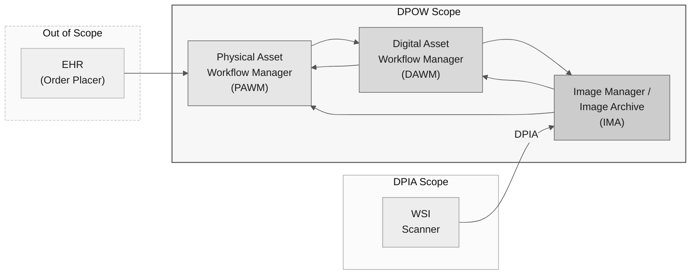

The Digital Pathology Ordering & Workflow (DPOW) Profile empowers the different systems in the digital pathology ecosystem with the data needed to drive the reading and ordering workflow. It addresses physical specimen registration (specimen, block, slide), case-level synchronisation, digital image availability notification, and the ordering of additional techniques. These use cases are expressed as messaging transactions using **HL7® v2.5.1**.

DPOW defines three actors - the **Physical Asset Workflow Manager (PAWM)**, the **Digital Asset Workflow Manager (DAWM)**, and the **Image Manager / Image Archive (IMA)** - and the HL7 v2 transactions between them. Adherence to the IHE Digital Pathology Image Acquisition (DPIA) profile plays an important role in a successful DPOW implementation, particularly because of the enriched metadata associated with DICOM Whole Slide Imaging (WSI) objects.

This supplement is a **Draft for Public Comment**. See the [significant changes and open/closed issues](issues.html).

> **Editorial note:** The transaction numbers used throughout this guide (LAB-100 through LAB-104) are placeholders and have not yet been formally agreed; they are pending assignment by the IHE Domain Coordination Committee (DCC).

### Ecosystem Overview

The diagram below illustrates the broader digital pathology ecosystem and highlights the scope covered by DPOW within it. Systems shown outside the DPOW scope boundary are not specified by this profile.

### Organization of This Guide

This guide is organized into the following sections:

1. Volume 1: Profile Detail
   1. [Introduction](volume-1.html)
   1. [Actors, Transactions, and Content Modules](volume-1.html#actors-and-transactions)
   1. [Actor Options](volume-1.html#actor-options)
   1. [Required Actor Groupings](volume-1.html#required-groupings)
   1. [Overview](volume-1.html#overview)
   1. [Security Considerations](volume-1.html#security-considerations)
   1. [Cross-Profile Considerations](volume-1.html#other-grouping)
2. Volume 2: Transaction Detail
   1. [Physical Asset Registration \[LAB-100\]](LAB-100.html)
   1. [Case Update \[LAB-101\]](LAB-101.html)
   1. [Place Work Order \[LAB-102\]](LAB-102.html)
   1. [Accept Work Order \[LAB-103\]](LAB-103.html)
   1. [Image Availability Notification \[LAB-104\]](LAB-104.html)
   1. [Volume 2 Appendices](volume-2-appendix.html) - Message abstract syntax and common HL7 segment definitions
3. Volume 3: Content Modules - *Not applicable. DPOW defines no content modules.*
4. Volume 4: National Extensions - *Not applicable. DPOW defines no national extensions.*
5. Other
   1. [Changes to Other IHE Specifications](other.html)
   1. [Download and Analysis](download.html)
   1. [Test Plan](testplan.html)

See also the [Table of Contents](toc.html) and the index of [Artifacts](artifacts.html) defined as part of this implementation guide.

### Conformance Expectations

IHE uses the normative words: "MUST", "MUST NOT", "REQUIRED", "SHALL", "SHALL NOT", "SHOULD", "SHOULD NOT", "RECOMMENDED", "MAY", and "OPTIONAL" according to [standards conventions](https://profiles.ihe.net/GeneralIntro/ch-E.html).

Because DPOW is an HL7 v2.5.1 messaging profile, conformance for individual message fields is additionally expressed using the HL7 v2 **Usage** codes in the segment tables of the [Volume 2 Appendices](volume-2-appendix.html):

| Usage | Meaning |
|---|---|
| **R** | Required |
| **RE** | Required but may be empty (populate if a value is available) |
| **O** | Optional |
| **C** | Conditional |
| **X** | Not supported |

#### Must Support

This guide contains no FHIR `StructureDefinition` profiles, so the FHIR `mustSupport` flag (equivalent to the IHE **R2** convention in [ITI TF-2 Appendix Z](https://profiles.ihe.net/ITI/TF/Volume2/ch-Z.html#z.10-profiling-conventions-for-constraints-on-fhir)) does not apply. DPOW conformance is defined entirely by the HL7 v2 message and segment specifications in Volume 2. The HL7 v2 Usage code **RE** is the DPOW equivalent of R2: the source actor SHALL populate an RE element when a value is available, and consuming actors SHALL handle the element being present or absent.
