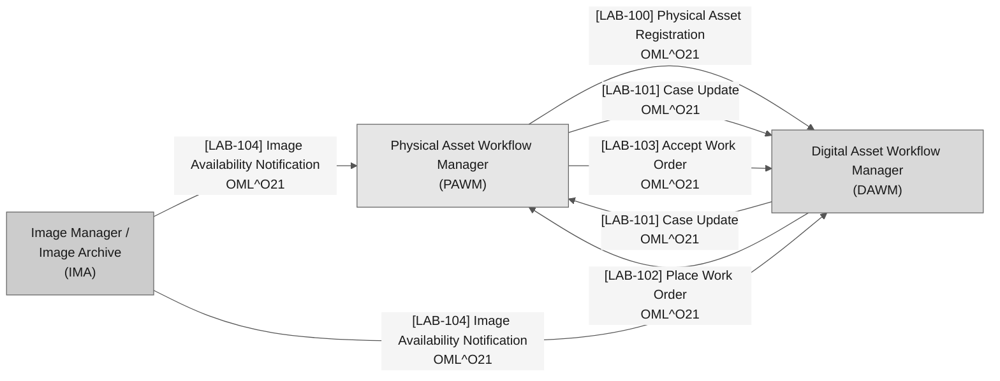
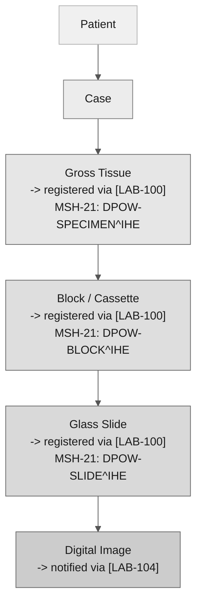
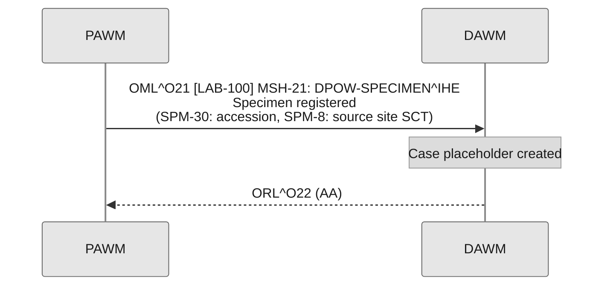
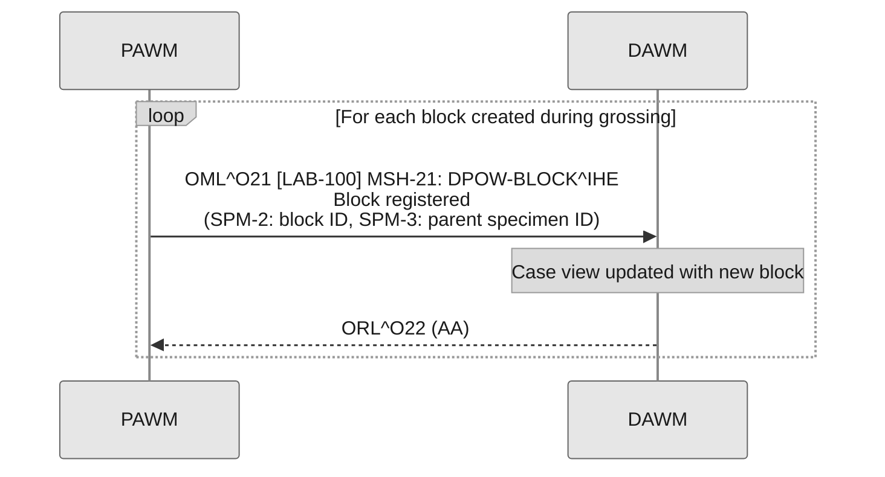
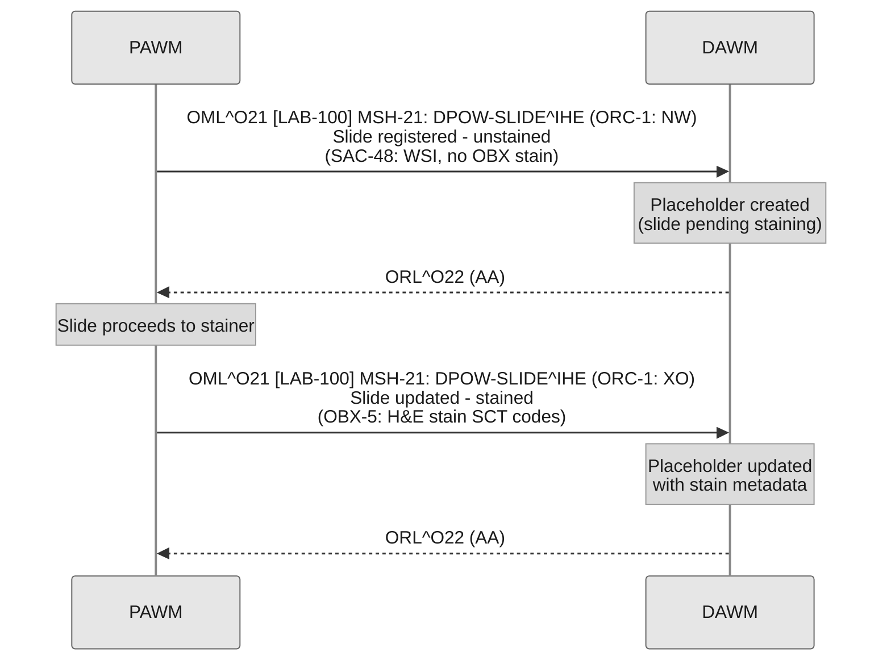
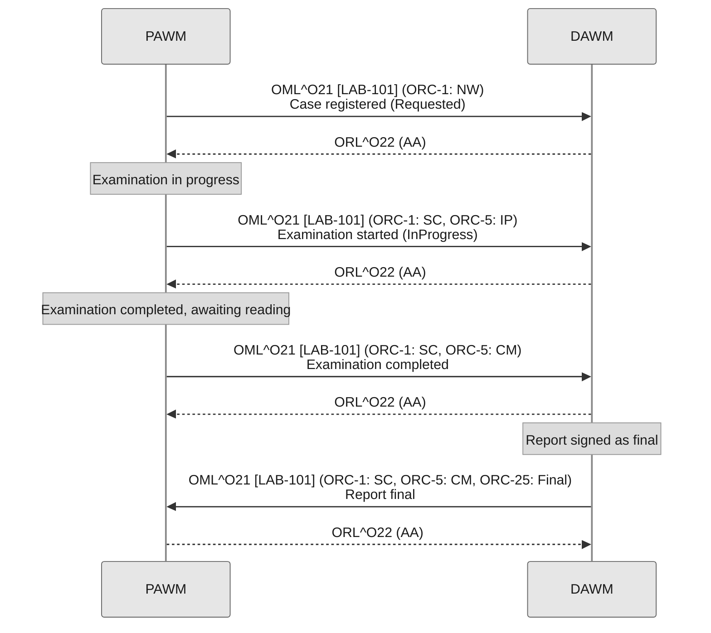
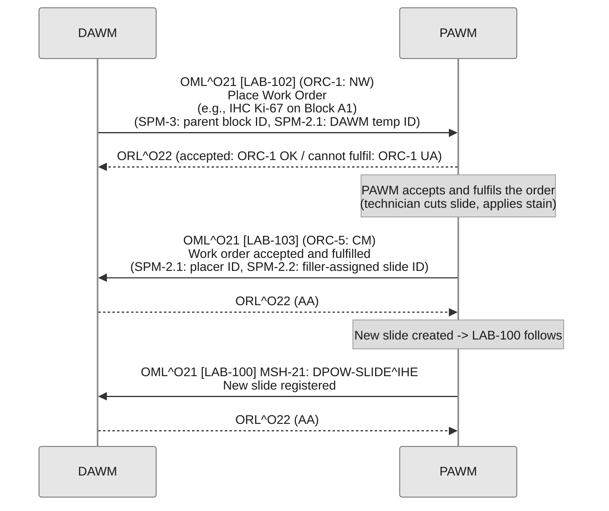
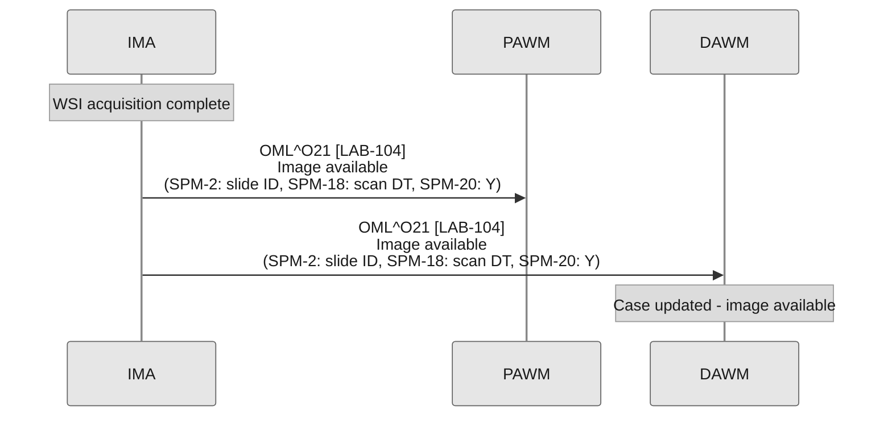

The Digital Pathology Ordering & Workflow (DPOW) Profile provides specifications for integrating the Physical Asset Workflow Manager (PAWM), the Digital Asset Workflow Manager (DAWM), and the Image Manager / Image Archive (IMA) in support of the end-to-end digital pathology ordering and workflow process.

DPOW addresses the data flows required to:

- Register physical assets (specimens, blocks, slides) from the PAWM to the DAWM
- Synchronise case-level updates (status and other case-level data) between PAWM and DAWM
- Place and accept work orders for specimen processing
- Notify relevant actors of digital image availability

DPOW represents an intermediate layer in the full clinical digital pathology workflow. The upstream image acquisition workflow is covered by the IHE PaLM DPIA profile. Diagnostic reporting and result distribution are covered by other profiles (e.g., APSR). Together, these profiles constitute the full integration requirements for a clinical digital pathology deployment.

## 1:XX.1 DPOW Actors, Transactions, and Content Modules

This section defines the actors, transactions, and content modules in this profile. General definitions of actors are given in the Technical Frameworks General Introduction [Appendix A](https://profiles.ihe.net/GeneralIntro/ch-A.html). IHE Transactions can be found in the Technical Frameworks General Introduction [Appendix B](https://profiles.ihe.net/GeneralIntro/ch-B.html).

The figure below shows the actors directly involved in the DPOW Profile and the relevant transactions between them.

**Figure 1:XX.1-1: DPOW Actor Diagram**

Table 1:XX.1-1 lists the transactions for each actor directly involved in the DPOW Profile. To claim compliance with this profile, an actor shall support all required transactions (labeled "R") and may support the optional transactions (labeled "O").

<strong>Table 1:XX.1-1: DPOW Profile - Actors and Transactions</strong>

| Actor | Transaction | Optionality | Reference |
|---|---|---|---|
| Physical Asset Workflow Manager (PAWM) | Physical Asset Registration [LAB-100] | R | [PaLM TF-2: 3.LAB-100](LAB-100.html) |
| | Case Update [LAB-101] | R | [PaLM TF-2: 3.LAB-101](LAB-101.html) |
| | Place Work Order [LAB-102] | O (Note 1) | [PaLM TF-2: 3.LAB-102](LAB-102.html) |
| | Accept Work Order [LAB-103] | O (Note 1) | [PaLM TF-2: 3.LAB-103](LAB-103.html) |
| | Image Availability Notification [LAB-104] | R | [PaLM TF-2: 3.LAB-104](LAB-104.html) |
| Digital Asset Workflow Manager (DAWM) | Physical Asset Registration [LAB-100] | R | [PaLM TF-2: 3.LAB-100](LAB-100.html) |
| | Case Update [LAB-101] | R | [PaLM TF-2: 3.LAB-101](LAB-101.html) |
| | Place Work Order [LAB-102] | O (Note 1) | [PaLM TF-2: 3.LAB-102](LAB-102.html) |
| | Accept Work Order [LAB-103] | O (Note 1) | [PaLM TF-2: 3.LAB-103](LAB-103.html) |
| | Image Availability Notification [LAB-104] | R | [PaLM TF-2: 3.LAB-104](LAB-104.html) |
| Image Manager / Image Archive (IMA) | Image Availability Notification [LAB-104] | R | [PaLM TF-2: 3.LAB-104](LAB-104.html) |
{: .grid}

Note 1: *Place Work Order [LAB-102] and Accept Work Order [LAB-103] are optional as a group (the Additional Work Order Option). If an actor implements either transaction, it SHALL implement both. See Section 1:XX.2.*

Note 2: *For [LAB-100], the `DPOW-SLIDE^IHE` flavour is the minimum required. Support for `DPOW-SPECIMEN^IHE` and `DPOW-BLOCK^IHE` flavours is optional and governed by the Specimen Registration Option and Block Registration Option respectively. See Section 1:XX.2.*

### 1:XX.1.1 Actors

The actors in this profile are described in more detail in the sections below.

#### 1:XX.1.1.1 Physical Asset Workflow Manager (PAWM)

The PAWM assumes the following interoperability responsibilities in the context of the DPOW workflow:

- Identifies and registers physical assets (specimens, blocks, slides) and broadcasts their availability to the DAWM via [LAB-100].
- Sends and receives case-level updates via [LAB-101].
- Receives and fulfils work orders (e.g., recuts, IHC, panels) placed by the DAWM via [LAB-102] / [LAB-103].
- Receives digital image availability notifications from the IMA via [LAB-104].
- Acts as the order filler in the HL7 placer/filler model for [LAB-102] (receiving work orders from DAWM) and [LAB-103] (responding to those orders).

This actor is frequently associated to a Laboratory Information System (LIS).

#### 1:XX.1.1.2 Digital Asset Workflow Manager (DAWM)

The DAWM assumes the following interoperability responsibilities:

- Receives specimen, block, and slide registration messages from the PAWM via [LAB-100] and uses this information to maintain a current view of the physical pathology workflow.
- Sends and receives case-level updates via [LAB-101].
- Places work orders to the PAWM for work on physical assets via [LAB-102] (e.g., ordering recuts, additional stains, or new blocks).
- Receives digital image availability notifications from the IMA via [LAB-104].
- Coordinates the digital pathology workflow, enabling pathologist assignment, case status tracking, and workload management.

This actor is realised by a digital pathology workflow orchestrator, usually a LIS or a PACS.

#### 1:XX.1.1.3 Image Manager / Image Archive (IMA)

The IMA stores digital pathology images and notifies the PAWM and DAWM of image availability and status changes. Refer to the IHE PaLM DPIA profile for the full definition of this actor's responsibilities in the image acquisition workflow. In the context of DPOW, the IMA:

- Sends image availability notifications ([LAB-104]) to the PAWM and DAWM when a new whole slide image becomes available.
- Sends de-association notifications ([LAB-104]) when a physical asset no longer has an image available associated with it.

### 1:XX.1.2 Transaction Descriptions

The transactions in this profile are specified in detail in Volume 2:

- [Physical Asset Registration \[LAB-100\]](LAB-100.html) - the PAWM registers a specimen, block, or slide and broadcasts its metadata to the DAWM.
- [Case Update \[LAB-101\]](LAB-101.html) - the PAWM or DAWM synchronises case-level data (status and other case-level updates).
- [Place Work Order \[LAB-102\]](LAB-102.html) - the DAWM orders additional work on a physical specimen.
- [Accept Work Order \[LAB-103\]](LAB-103.html) - the PAWM responds to a work order.
- [Image Availability Notification \[LAB-104\]](LAB-104.html) - the IMA notifies availability or de-association of a WSI.

## 1:XX.2 DPOW Actor Options

Options that may be selected for each actor in this profile are listed in Table 1:XX.2-1. Dependencies between options, when applicable, are specified in notes.

<strong>Table 1:XX.2-1: DPOW - Actors and Options</strong>

| Actor | Option Name | Transaction / Flavour | Reference |
|---|---|---|---|
| Physical Asset Workflow Manager (PAWM) | Specimen Registration Option | [LAB-100] `DPOW-SPECIMEN^IHE` | Section 1:XX.2.1 |
| | Block Registration Option | [LAB-100] `DPOW-BLOCK^IHE` | Section 1:XX.2.2 |
| | Additional Work Order Option | [LAB-102] + [LAB-103] | Section 1:XX.2.3 |
| Digital Asset Workflow Manager (DAWM) | Specimen Registration Option | [LAB-100] `DPOW-SPECIMEN^IHE` | Section 1:XX.2.1 |
| | Block Registration Option | [LAB-100] `DPOW-BLOCK^IHE` | Section 1:XX.2.2 |
| | Additional Work Order Option | [LAB-102] + [LAB-103] | Section 1:XX.2.3 |
{: .grid}

The **`DPOW-SLIDE^IHE` flavour of [LAB-100]** is the minimum required for both PAWM and DAWM. It covers the most common interoperability scenario - slide-level registration for digital pathology workflows.

### 1:XX.2.1 Specimen Registration Option

The Specimen Registration Option adds support for specimen/container registration (`DPOW-SPECIMEN^IHE`). Laboratories that perform accessioning-level integration with the DAWM should implement this option. Both actors (PAWM and DAWM) SHALL declare the same set of [LAB-100] options to ensure that every flavour sent by the PAWM can be received and processed by the DAWM.

### 1:XX.2.2 Block Registration Option

The Block Registration Option adds support for block/cassette registration (`DPOW-BLOCK^IHE`). Laboratories that expose grossing workflow data to the DAWM should implement this option.

### 1:XX.2.3 Additional Work Order Option

The Additional Work Order Option covers Place Work Order [LAB-102] and Accept Work Order [LAB-103] as an interdependent group. An actor claiming the Additional Work Order Option SHALL implement both transactions. Neither is meaningful without the other.

## 1:XX.3 DPOW Required Actor Groupings

An actor from this profile SHALL implement all of the required transactions in this profile **in addition to all** of the requirements for the grouped actor (Column 2).

<strong>Table 1:XX.3-1: DPOW - Required Actor Groupings</strong>

| DPOW Actor | Actor(s) may be grouped with | Reference |
|---|---|---|
| Physical Asset Workflow Manager (PAWM) | IHE PaLM DPIA / Acquisition Manager | IHE PaLM DPIA |
| Image Manager / Image Archive (IMA) | IHE PaLM DPIA / Image Manager / Image Archive | IHE PaLM DPIA |
| All DPOW actors | IHE ITI CT / Time Client | [ITI TF-1: 7.1](https://profiles.ihe.net/ITI/TF/Volume1/ch-7.html) |
{: .grid}

All actors in DPOW SHOULD be grouped with the Consistent Time (CT) Profile - Time Client Actor to ensure consistent timestamps across audit logs and messages.

## 1:XX.4 DPOW Overview

### 1:XX.4.1 Concepts

DPOW relies on the hierarchical physical asset model established in the Proposed DICOM Pathology Data Model of the IHE PaLM DPIA profile:

**Figure 1:XX.4.1-1: DPOW Physical Asset Hierarchy**

Each level in this hierarchy is registered and broadcast by the PAWM as physical assets are created in the laboratory. The DAWM receives these registrations and builds a case-level view for workflow coordination.

The DAWM may request additional work at any level of the hierarchy using [LAB-102], and the PAWM responds with the result using [LAB-103]. Image availability at the bottom of the hierarchy is notified by the IMA using [LAB-104]. Case-level status is synchronised between PAWM and DAWM at any point during the workflow using [LAB-101].

### 1:XX.4.2 Use Cases

Use cases are informative, not normative; "SHALL" language is not used in this section.

#### 1:XX.4.2.1 Use Case #1: Specimen Registration (Accessioning)

##### Use Case Description

Upon receipt of a surgical specimen, the PAWM registers the specimen (container) and broadcasts its availability to the DAWM. This allows the DAWM to create a placeholder for the case and begin tracking the physical asset through the pathology workflow.

- **Actors:** PAWM (source), DAWM (destination)
- **Transaction:** Physical Asset Registration [LAB-100]
- **MSH-21:** `DPOW-SPECIMEN^IHE`
- **Message:** OML^O21

**Key parameters:**

- Case accession number (unique per organisation) in SPM-30 / OBR-3, and in ORC-38 (Filler Order Group Number) for alignment with DPIA (see [Closed Issue 7](issues.html))
- Container ID (unique per case) in SPM-2 / SAC-3
- Specimen source site (SPM-8, ideally SCT), e.g., breast structure
- Specimen type (SPM-4), e.g., TISS (tissue)
- Fixative information in OBX-5 (CWE), e.g., Formalin (SCT)

##### Process Flow

#### 1:XX.4.2.2 Use Case #2: Block Creation During Grossing

##### Use Case Description

During the grossing process, a histotechnologist creates tissue blocks from the received specimen. Each block is registered by the PAWM and broadcast to the DAWM, updating the case view with the new physical assets.

- **Actors:** PAWM (source), DAWM (destination)
- **Transaction:** Physical Asset Registration [LAB-100]
- **MSH-21:** `DPOW-BLOCK^IHE`
- **Message:** OML^O21

**Key parameters:**

- Block ID (unique per case) in SPM-2
- Parent specimen ID in SPM-3
- Specimen source site modifier (SPM-9, ideally SCT) for laterality
- Embedding medium in OBX-5 (CWE), e.g., Paraffin wax (SCT)

##### Process Flow

#### 1:XX.4.2.3 Use Case #3: Slide Creation and Registration

##### Use Case Description

Glass slides are created from blocks. Each slide (stained or unstained) is registered by the PAWM and broadcast to the DAWM. Unstained slides create placeholders indicating that a stained slide is pending or forthcoming.

- **Actors:** PAWM (source), DAWM (destination)
- **Transaction:** Physical Asset Registration [LAB-100]
- **MSH-21:** `DPOW-SLIDE^IHE`
- **Message:** OML^O21

**Key parameters:**

- Slide ID (unique per case) in SPM-2
- Parent block ID in SPM-3
- Stain information in OBX-5 (CWE), e.g., Hematoxylin + Eosin (SCT)
- Container type (glass slide) in SPM-27 / SAC-48

##### Process Flow

#### 1:XX.4.2.4 Use Case #4: Case Update

##### Use Case Description

At key points in the case lifecycle, either the PAWM or DAWM sends a case-level update to the other actor to keep the case synchronised. An update may carry any case-level data; workflow-status milestones are the most common example. Physical workflow milestones (e.g., grossing complete, pre-analytical complete) are sent by the PAWM. Digital workflow events (e.g., pathologist assigned, reading in progress, case verified) are sent by the DAWM.

- **Actors:** PAWM or DAWM (source), the other actor (destination)
- **Transaction:** Case Update [LAB-101]
- **MSH-21:** `DPOW-CASE-UPDATE^IHE`
- **Message:** OML^O21

**Key parameters:**

- ORC-5 (Order Status): high-level case state
- ORC-25 (Order Status Modifier): case sub-status; see value set in [3.LAB-101](LAB-101.html)

##### Process Flow

#### 1:XX.4.2.5 Use Case #5: Work Order (e.g., IHC, FISH, Recut)

##### Use Case Description

A pathologist or histotechnologist, via the DAWM, requests additional work on a physical asset - such as immunohistochemistry (IHC), FISH, or a recut of an existing block. The DAWM places the order to the PAWM, which fulfils it and responds.

- **Actors:** DAWM (order placer), PAWM (order filler)
- **Transactions:** Place Work Order [LAB-102] (DAWM->PAWM), Accept Work Order [LAB-103] (PAWM->DAWM)
- **Message:** OML^O21

[LAB-103] is sent once, when the PAWM has accepted and fulfilled the order: ORC-5 = `CM`, with SPM-2.1 carrying the placer identifier and SPM-2.2 the filler-assigned identifier of the new asset. If the PAWM cannot accept or fulfil the order, that is conveyed in the `ORL^O22` acknowledgement to [LAB-102] (ORC-1 = `UA`) and no [LAB-103] is sent.

##### Process Flow

#### 1:XX.4.2.6 Use Case #6: Digital Image Availability Notification

##### Use Case Description

When a whole slide image becomes available in the IMA (following acquisition via DPIA), the IMA notifies the PAWM and DAWM. This enables the DAWM to update the case view and trigger further workflow steps. A subsequent Case Update [LAB-101] with `ORC-5: CM` (all expected images imported) may follow.
[LAB-104] is naturally linked to the IHE DPIA transaction "Completion Document Stored".

- **Actors:** IMA (source), PAWM and DAWM (destinations)
- **Transaction:** Image Availability Notification [LAB-104]
- **Message:** OML^O21

##### Process Flow

#### 1:XX.4.2.7 Use Case #7: Image De-association / Removal Notification

##### Use Case Description

An image may need to be removed or flagged from the case view - for example, a 20x scan deemed insufficient is superseded by a 40x rescan. The IMA notifies the PAWM and DAWM of the removal or de-association using `SPM-20 = N`.

- **Actors:** IMA (source), PAWM and DAWM (destinations)
- **Transaction:** Image Availability Notification [LAB-104]
- **Message:** OML^O21

> **Note:** The notification is sent only when there are no more slide images associated to a physical asset.

## 1:XX.5 DPOW Security Considerations

DPOW transactions convey Personal Health Information (PHI). Implementers SHALL consider the security and privacy environment in which DPOW is deployed. The following forms of attack, at minimum, should be considered: eavesdropping, replay, message insertion, deletion, modification, man-in-the-middle, and denial of service. DPOW is expected to be deployed between systems within a single organisation on an internal network; the groupings below provide the baseline countermeasures.

### 1:XX.5.1 Consistent Time (CT)

All actors in DPOW SHOULD be grouped with the Consistent Time (CT) Profile - Time Client Actor to ensure a consistent system clock across all actors for audit logging and message timestamp accuracy.

### 1:XX.5.2 Audit Trail and Node Authentication (ATNA)

The IHE ITI Audit Trail and Node Authentication (ATNA) Profile SHOULD be implemented by all actors to protect node-to-node communication and produce an audit trail of PHI-related actions. Where an actor is grouped with an ATNA Secure Node or Secure Application, it SHALL record the relevant audit events for the DPOW transactions it supports.

### 1:XX.5.3 Cross-Enterprise User Assertion (XUA)

When sending information between clinical documentation and laboratory systems, it may be necessary to firmly establish the identity of the users performing each action. The Cross-Enterprise User Assertion (XUA) Profile MAY be utilised for this purpose.

> **Note:** XUA is recommended over IUA for DPOW, as DPOW is expected to be deployed between systems within the same organisation on the same internal network.

## 1:XX.6 DPOW Cross-Profile Considerations

This section is informative, not normative. It is intended to put this profile in context with other profiles.

### 1:XX.6.1 DPIA - Digital Pathology Workflow - Image Acquisition

DPOW is designed to operate in conjunction with the IHE PaLM DPIA profile. DPIA covers the acquisition of digital images from physical glass slides. DPOW covers the upstream specimen registration workflow and the downstream image availability notification. Implementers should implement both profiles to achieve a complete end-to-end digital pathology workflow.

The IMA actor in DPOW corresponds to the Image Manager / Image Archive actor in DPIA.

### 1:XX.6.2 Invoke Image Display (IID)

The Invoke Image Display (IID) profile MAY be used in conjunction with DPOW to enable non-image-aware systems (such as the PAWM) to invoke display of a pathology study in the DAWM or an associated image viewer.
